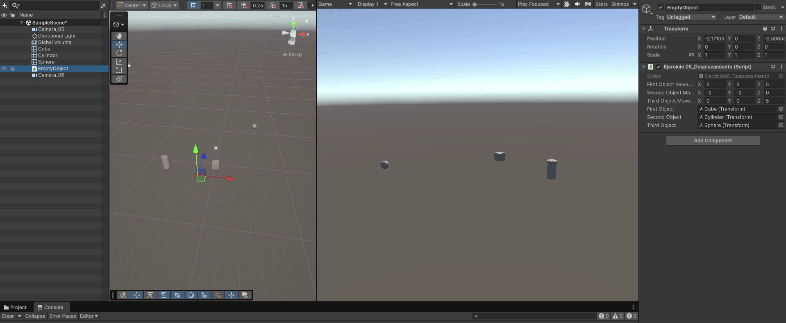
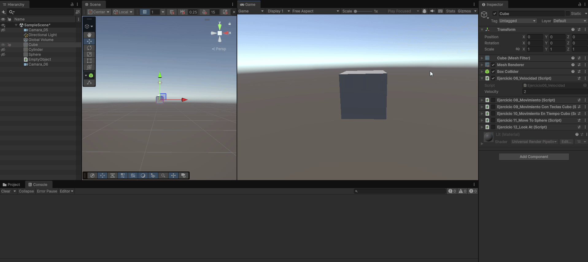
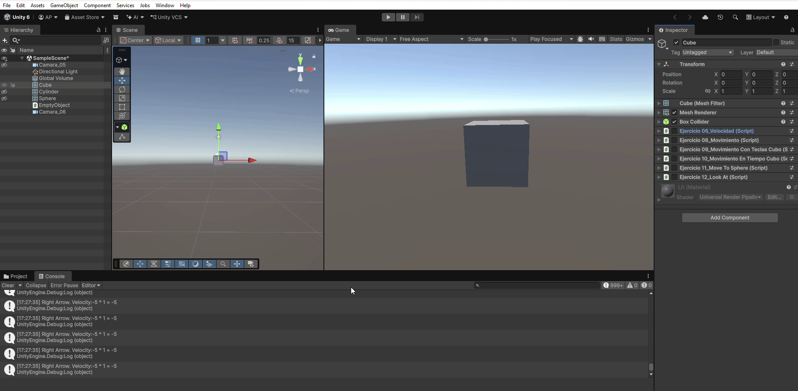
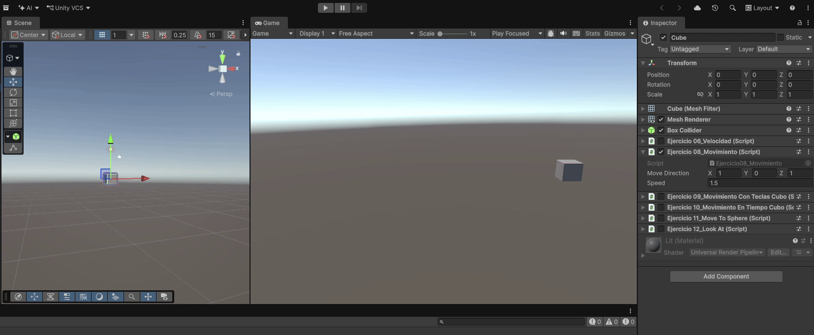
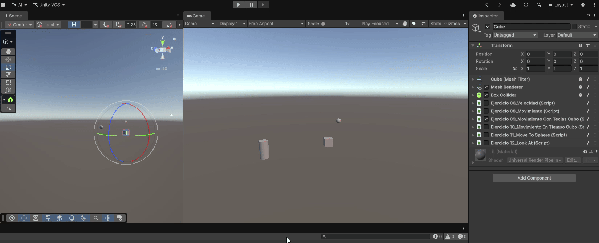
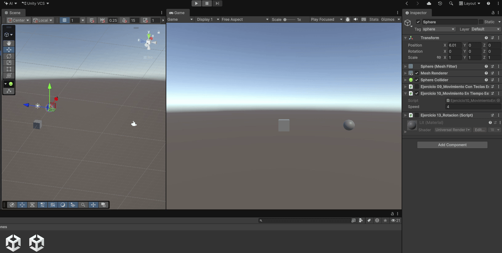
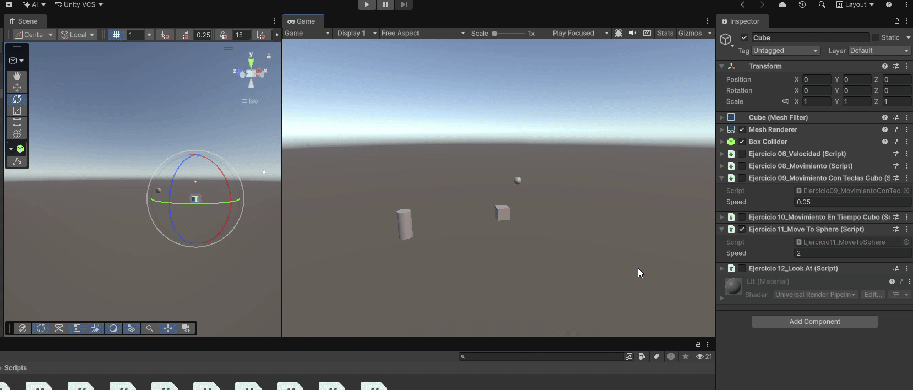
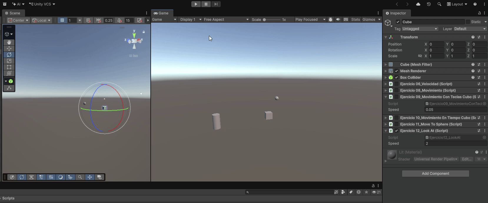
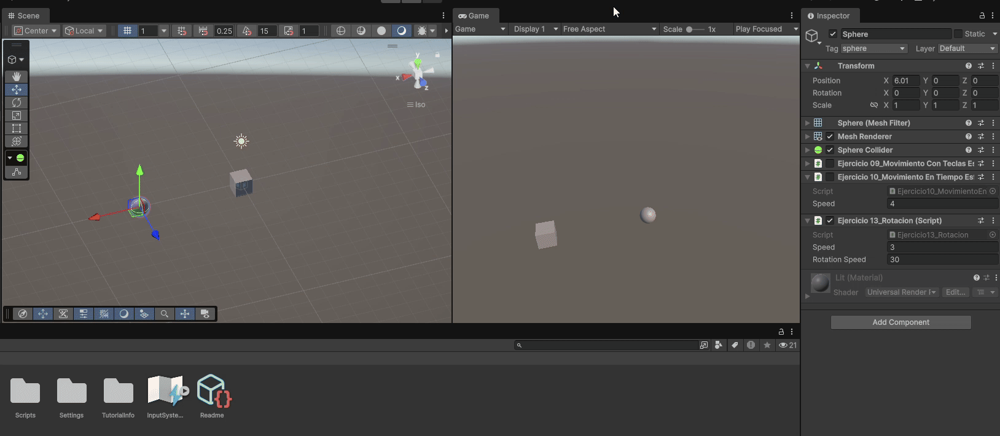

# Práctica 02. Movimiento.

## Índice
* [Introducción](#introducción)
* [Ejercicio 05. Desplazamiento](#ejercicio-05-desplazamiento)
* [Ejercicio 06. Velocidad](#ejercicio-06-velocidad)
* [Ejercicio 07. Mapea de teclas a acciones](#ejercicio-07-mapeo-de-teclas-a-acciones)
* [Ejercicio 08. Análisis de Movimiento](#ejercicio-08-análisis-de-movimiento)
* [Ejercicio 09. Movimiento con teclas](#ejercicio-09-movimiento-con-teclas)
* [Ejercicio 10. Movimiento proporcional al tiempo transcurrido](#ejercicio-10-movimiento-proporcional-al-tiempo-transcurrido)
* [Ejercicio 11. Movimiento dirigido](#ejercicio-11-movimiento-dirigido)
* [Ejercicio 12. LookAt()](#ejercicio-12-lookat)
* [Ejercicio 13. Rotación](#ejercicio-13-rotación)

## Introducción
Este informe recoge el desarrollo de la Segunda Práctica de la asignatura Interfaces Inteligentes, la cuál ahonda en el movimiento de objetos dentro de una escena. Además, se sigue profundizando en el uso de scripts para programar los comportamientos deseados.

Una vez más, ha sido necesario visitar el [Manual de Unity](https://docs.unity3d.com/Manual/index.html) para aprender a usar diferentes clases y métodos tales como `Rotate()` o `LookAt()`.

## Ejercicio 05. Desplazamiento

El fichero con el código se encuentra en [Assets/Scripts/Ejercicio05_Desplazamiento.cs](Assets/Scripts/Ejercicio05_Desplazamiento.cs)

### Descripción
Mediante el uso de tres objetos *Empty*, cada uno con un atributo Vector3 asociado, se pretendía que tras presionar la tecla `Espacio`, se desplazaran 3 objetos la distancia especificada. 

### Implementación
- Como ya he mencionado, he creado varios objeto *Empty* en la escena a los que he agregado el script y que cuentan con un atributo que determina el desplazamiento.
- Además, sabiendo que en *InputManager* el espacio se asocia a la acción *Jump*, pude identificar cuándo el usuario presionaba la tecla.
- Finalmente, sólo fue necesario calcular la nueva distancia a partir de la inicial y del desplazamiento especificado.

### Ejecución

## Ejercicio 06. Velocidad

El fichero con el código se encuentra en [Assets/Scripts/Ejercicio06_Velocidad.cs](Assets/Scripts/Ejercicio06_Velocidad.cs)

### Descripción
Este ejercicio solicitaba que el programa mostrara por consola las veces que el usuario presionaba cada una de las flechas, obteniendo el valor del eje correspondiente e imprimiendo tanto la tecla como la velocidad.

Es importante mencionar que la velocidad no pasa instantáneamente de 0 a 1 o -1, sino que gradualmente avanza y al segundo ya adquiere su máximo valor. Esto fue algo que desconocía y que aprendí realizando el ejercicio.

### Implementación
- Conocer `Input.GetKey()` para verificar si el usuario se encuentra presionando una tecla concreta así como `KeyCode` que es el tipo que hay que pasar como parámetro fue esencial para poder realizar este ejercicio.
- Más allá de eso, se imprimen por consola mensajes, algo que ya se hizo en la práctica pasada.

### Ejecución

## Ejercicio 07. Mapeo de teclas a acciones.

### Descripción
Este ejercicio fue mucho más breve, pues solo era necesario modificar un campo en las opciones del proyecto para que el mapeo de la acción Disparo (`fire1`) fuera a la tecla `h`. En el ejemplo se muestra el procedimiento seguido.

## Ejercicio 08. Análisis de Movimiento

El fichero con el código se encuentra en [Assets/Scripts/Ejercicio08_Movimiento.cs](Assets/Scripts/Ejercicio08_Movimiento.cs)

### Descripción
En este ejercicio se propuso mover un cubo a partir de una dirección y una velocidad. Luego se pide que se analicen diferentes comportamientos en base a los parámetros que se van indicando en el inspector.

### Implementación
Antes de pasar a comentar los resultados de cada una de las situaciones, voy a explicar cómo se implementó el movimiento.
- Para ello, simplemente fue necesario configurar como públicos los atributos de dirección de movimiento y velocidad y posteriormente aplicar la operación `Translate` al transform del cubo.

### Ejecución

### Resultados obtenidos
#### a. Duplicar las coordenadas de la dirección del movimiento
Cuando duplicamos las coordenadas, tal como se ve en el ejemplo, el cubo comienza a ir más rápido. Esto se debe a que no lo estamos normalizando. Por lo tanto el valor que contenga cada una de las coordenadas del vector de dirección influirá en la velocidad de movimiento. Para evitar este hecho, como haremos más adelante, se usa `.normalized`, delegando la velocidad en el atributo `speed`.

#### b. Duplicar la velocidad manteniendo la dirección
Al igual que en el caso anterior, se acelera el movimiento del cubo. En este caso es lo esperado, pues estamos dándole más velocidad.

#### c. Reducir la velocidad por debajo de 1
Para este caso, probamos dos alternativas: 
- Si la velocidad es un valor entre 0 y 1, lo único que ocurre es que el movimiento se ralentiza bastante.
- Si la velocidad es negativa, entonces va hacia atrás.

#### d. La altura del cubo es superior a 0
Gracias a las comprobaciones realizadas en el método `Start()`, el cubo comienza inicialmente en la coordenada 0 del eje Y. Posteriormente, en función del vector de dirección, se podrá desplazar a lo largo de los 3 ejes, pero en un primer momento nos aseguramos de que empiece en 0.

#### e. Intercambiar el movimiento relativo al sistema de referencia local y el mundial
- Utilizando el sistema de referencia local, si el cubo está rotado entonces el movimiento se realizará en el eje determinado por dicha rotación y no siguiendo los ejes del mundo.

- Sin embargo, el sistema de referencia global tiene solo en cuenta los ejes del mundo y por tanto no tiene en cuenta si los ejes del objeto han sido desplazados o rotados.

## Ejercicio 09. Movimiento con Teclas

Este ejercicio tiene dos ficheros de código (muy similares) que se encuentran en:
- [Assets/Scripts/Ejercicio09_MovimientoConTeclasCubo.cs](Assets/Scripts/Ejercicio09_MovimientoConTeclasCubo.cs)
- [Assets/Scripts/Ejercicio09_MovimientoConTeclasEsfera.cs](Assets/Scripts/Ejercicio09_MovimientoConTeclasEsfera.cs)

### Descripción

Este es el primer ejercicio en el que se asocian las teclas con el movimiento de los objetos. El cubo se debe poder mover con las flechas mientras que la esfera debe poder hacerlo con las teclas A, S W y D.

Los movimientos se deben hacer en los ejes X y Z y una vez más contamos con el atributo `Speed`.

### Implementación
- La implementación se realizó utilizando el material de ejercicios anteriores (usando un Translate con la multiplicación de la velocidad por el eje y por el vector unitario del mismo).
- Es importante mencionar que fue necesario crear varios ejes auxiliares en el InputManager llamados *FlechasVertical*, *FlechasHorizontal*, *ADHorizontal* y *WSVertical*. Gracias a estos ejes desacoplamos el procesamiento de las teclas y no se generan conflictos en los ejes (con *Horizontal* y *Vertical* sí hubieran ocurrido).
- Los vectores unitarios de los ejes utilizados fueron `Vector3.right` y `Vector3.forward`.

### Ejecución

## Ejercicio 10. Movimiento proporcional al tiempo transcurrido

Este ejercicio también tiene dos ficheros de código (muy similares) que se encuentran en:
- [Assets/Scripts/Ejercicio10_MovimientoEnTiempoCubo.cs](Assets/Scripts/Ejercicio10_MovimientoEnTiempoCubo.cs)
- [Assets/Scripts/Ejercicio10_MovimientoEnTiempoEsfera.cs](Assets/Scripts/Ejercicio10_MovimientoEnTiempoEsfera.cs)

### Descripción 
Este ejercicio es muy similar al anterior pero se pretende resolver el problema de que en algunos dispositivos, o incluso en el mismo dispositivo pero en diferentes momentos, la carga y generación de los frames puede tardar diferentes periodos de tiempo.

### Implementación

Para resolver el problema, añadimos a la multiplicación de dentro del `Translate` el factor `Time.deltaTime`, como ya hicimos en algún apartado anterior para mejorar la visualización de los ejemplos.

Si bien en los vídeos de este ejercicio y el anterior parece que van a velocidades similares, es importante ver que la velocidad en este caso es superior a 1 y en el anterior se acercaba bastante a 0.

### Ejecución

## Ejercicio 11. Movimiento Dirigido

El fichero con el código se encuentra en [Assets/Scripts/Ejercicio11_MoveToSphere.cs](Assets/Scripts/Ejercicio11_MoveToSphere.cs)

### Descripción
En este ejercicio se propone que el cubo se mueva hacia la posición en la que se encuentre la esfera. Además, la velocidad debe ser constante y no cambiar en base a la distancia entre los objetos.

### Implementación
- Para obtener el vector de dirección se restaron las distancias entre las posiciones (`transform.position`) de los objetos.
- Para ubicar a la esfera, si bien podría haber creado un atributo público `GameComponent`, preferí utilizar el tag como hicimos en la práctica pasada.
- Finalmente se normaliza el vector de distancia y se multiplica por la velocidad y el delta del tiempo.

### Ejecución

## Ejercicio 12. LookAt()

El fichero con el código se encuentra en [Assets/Scripts/Ejercicio12_LookAt.cs](Assets/Scripts/Ejercicio12_LookAt.cs)

### Descripción
Este ejercicio es una modificación del ejercicio anterior y se pide que el cubo, a la vez que persigue a la esfera, siempre le mire.

### Implementación
Gracias a la ayuda del enunciado, la implementación fue bastante simple pues solo fue necesario añadir `transform.LookAt()` y el transform de la esfera.

### Ejecución

## Ejercicio 13. Rotación

El fichero con el código se encuentra en [Assets/Scripts/Ejercicio13_Rotacion.cs](Assets/Scripts/Ejercicio13_Rotacion.cs)

### Descripción
En este último ejercicio, se pide que modifiquemos uno de los ejercicios anteriores para que el movimiento de la esfera siempre se haga en el eje Z. Esto quiere decir que, al presionar cualquier tecla del eje horizontal, el objeto debe rotar y moverse hacia delante para avanzar en el eje Z.

### Implementación
Tomando como referencia la estructura de programas anteriores se presentan dos posibles operaciones:
- Si el eje horizontal cambia su valor, se realiza la operación `Rotate` rotando sobre el eje Y (`Vector3.up`).
- Si varía el eje vertical, se aplica un `Translate` como los que ya hemos descrito en apartados anteriores.

### Ejecución

